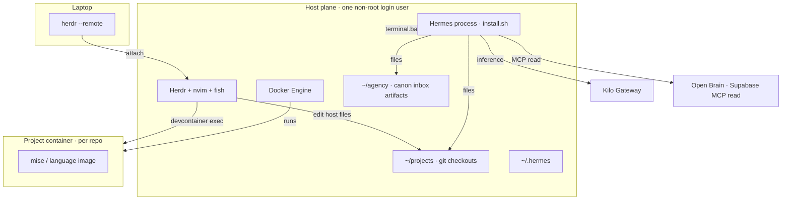
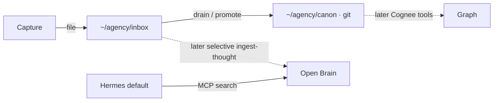

# Hermes stack — VPS playbook

Runbook for **`grr-remote-dev-01`** (Ubuntu 24.04, RackGenius GR). Vocabulary: `CONTEXT.md`. Hard decisions: `docs/adr/0001`–`0007`. This file **replaces** the earlier “Cognee as MemoryProvider + Docker terminal sandbox” guide.

Official Hermes install: `curl -fsSL https://hermes-agent.nousresearch.com/install.sh | bash` (verified against 0.20.6). Do **not** run Hermes in `nousresearch/hermes-agent`. Do **not** run `hermes memory setup`.





---

## 0. What you are building

| Piece | Choice | ADR |
|---|---|---|
| Daily coding | **Remote attach**: Herdr + nvim on the host plane; toolchains in **project containers** | 0001 |
| Hermes process | Native `install.sh` on the host plane | 0004 |
| Hermes shell | `terminal.backend: local` (official default). Approvals on, YOLO off | 0004 |
| Memory provider slot | **Empty** (`hermes memory off`). Built-in MEMORY/USER + session FTS stay on | 0002 |
| Trees | `~/agency/{canon,inbox,artifacts}` and `~/projects/<repo>`. Only **canon** is a git repo | 0003 |
| Profiles | Role = profile. Day one: only `default` (operator, including coding) | 0005 |
| Open Brain | Existing Supabase; **MCP read**, not the dock, not MemoryProvider | 0006 |
| Inference | Kilo Gateway; MiniMax Plus (M3 reasoning default + vision); DeepSeek V4 Pro for research; MoA council (M3 + M2.7 + V4 Pro); Flash auxiliary + fallback | (unchanged) |
| Graph | Cognee **later**, as tools over promoted canon — never `memory.provider: cognee` | 0002 |

**Non-goals this phase:** Telegram gateway as the dock, Cognee install, Honcho, Hermes-in-Docker, a generic Docker sandbox for Hermes, model-named profiles (`hermes-m27`, …), `--clone-all`, filling the provider slot “to be safe.”

Two Dockers (do not mix them up):

| Use | This stack |
|---|---|
| Hermes *in* a container | **No.** Official image is supported; we do not use it. |
| Docker as Hermes `terminal.backend` | **No** as the daily path. Available later for one untrusted job. |
| Docker for **project containers** | **Yes.** Operator and Hermes `devcontainer exec` into them. |

---

## 1. VPS baseline

Target box: `grr-remote-dev-01` (`163.123.236.73`). Inference stays on Kilo — no local LLMs.

| Resource | Minimum | Comfortable |
|---|---|---|
| OS | Ubuntu 24.04 LTS | Ubuntu 24.04 |
| vCPU | 2 | 2–4 |
| RAM | 4 GB | **8 GB** (Docker project containers + Herdr + Hermes) |
| Disk | 40 GB | 40 GB+ |
| Network | SSH | Tailscale-only when the tailnet ticket is done |

**One non-root login user** for Herdr, Hermes, and Docker. Do not run the agent as root (current access note on the server inventory is a cutover item). Do not invent a second `hermes` Unix user unless a session contaminates the other job.

```bash
ssh root@163.123.236.73
apt update && apt upgrade -y
apt install -y curl git xz-utils ufw fail2ban ca-certificates gnupg
# create YOURUSER if missing; copy SSH keys; usermod -aG sudo YOURUSER
```

Firewall: SSH only until Tailscale is live. Do **not** expose dashboard `9119` or gateway `8642` on the public IP.

```bash
ufw default deny incoming
ufw default allow outgoing
ufw allow OpenSSH
ufw enable
```

Host-plane bounce kit (ADR-0008): Homebrew on Linux at `/home/linuxbrew/.linuxbrew`, not Ubuntu apt, not Nix, not griffo on the host. `brew bundle` a Brewfile of fish, neovim, yazi, lazygit, zoxide, eza, bat, ripgrep, fd, fzf. Login shell stays bash. Herdr `default_shell` is brew’s fish; `herdr.service` PATH includes linuxbrew. Herdr itself stays `install.sh` + systemd — do not `brew install herdr`. Chezmoi user-lane configs on `/home/david` with a VPS profile (no Hypr/browsers/espanso/`pass`). Language runtimes stay in project containers.

---

## 2. Docker (project containers, not the Hermes shell)

```bash
# as root
curl -fsSL https://get.docker.com | sh
usermod -aG docker YOURUSER
```

Log out; SSH back in **as YOURUSER**. `docker run --rm hello-world`.

Base image for project containers (map decisions #8 / #9): `ghcr.io/dvogeldev/remote-dev-base:1-noble` (Dockerfile.base in this repo; built from `mcr.microsoft.com/devcontainers/base:ubuntu-24.04` plus Yazi, bat, ripgrep, fd, fzf, tldr, mise, git, curl, build-essential). Node/Python **per project**. Publish to **GHCR**; Docker Hub is upstream only. nvim stays on the host plane.

A project lives at `~/projects/<repo>` with `.devcontainer/devcontainer.json`. Operator pane: `devcontainer exec`. Hermes (local backend) can run the same command.

Host `devcontainer` CLI: `npm install -g @devcontainers/cli` using Hermes’ Node (`~/.hermes/node`, already on `PATH` via `~/.local/bin`). Binary: `~/.local/bin/devcontainer`. Do not apt-install Node as the project toolchain.

**Mount rule:** a project container sees **only that repo**. No `~/agency`, no `~/.hermes`.

---

## 3. Herdr on the host plane

```bash
curl -fsSL https://herdr.dev/install.sh | sh
```

systemd user unit + linger (map #10 / #14): not started by hand each SSH. After the bounce kit: linuxbrew on that unit’s `PATH`, `default_shell` = brew fish. Laptop: `herdr --remote grr` (Tailscale MagicDNS). nvim in a Herdr pane on the **host** checkout.

Do not run Herdr inside a project container as the default (rebuilds kill the mux). Do not `chsh` to fish.

---

## 4. Directory trees

```bash
mkdir -p ~/agency/{canon,inbox,artifacts} ~/projects
git init ~/agency/canon
# add a remote for canon when you have one
```

```text
~/agency/canon/       git wiki — only git repo on this shelf
~/agency/inbox/       file dock — untracked
~/agency/artifacts/   outputs — untracked
~/projects/<repo>/    coding + .devcontainer
~/.hermes/            Hermes data — not a workspace bind-mount
```

Drop `~/workspace` as a name.

---

## 5. Install Hermes (native, per-user)

As YOURUSER:

```bash
curl -fsSL https://hermes-agent.nousresearch.com/install.sh | bash
echo 'export PATH="$HOME/.local/bin:$PATH"' >> ~/.bashrc
source ~/.bashrc
hermes --version
hermes doctor
```

Layout: code `~/.hermes/hermes-agent/`, binary `~/.local/bin/hermes`, data `~/.hermes/`. Browser later; installer `--skip-browser` is fine day one.

```bash
hermes setup
```

Model context ≥64K; tools = files / terminal / web; browser off; **approvals on**; gateway **later**.

```bash
hermes config set terminal.backend local
hermes memory off
hermes memory status
```

`memory off` clears only the **external** slot. Built-in MEMORY.md / USER.md stay on. Cognee is **not** a bundled `hermes memory setup` plugin on this release line.

Optional first week: `memory.write_approval: true`. Caps default 2200 / 1375.

---

## 6. Kilo + MiniMax Plus

### 6.1 Account (browser, not the VPS)

1. [kilo.ai](https://kilo.ai) — fund credits.
2. Marketplace → **MiniMax Token Plan Plus**.
3. Confirm M2.7, M2.7-highspeed, and M3 on one quota bar.
4. Create a Kilo Gateway API key.

### 6.2 Point Hermes at Kilo

Secrets live in laptop **`pass`**, not in git and not in Cloudflare Secrets Store (ADR-0007). Checkout:

```bash
# store of record (already present):
#   pass show kilocode/KILOCODE_API_KEY
./scripts/unwrap-hermes-env.sh   # SSH Host grr → ~/.hermes/.env mode 600
```

Then on the VPS:

```bash
hermes config set model.provider kilocode
hermes config set model.default minimax/minimax-m3
```

`hermes model` works too if you prefer the wizard. Do not paste keys into chat or into the repo.

```yaml
# ~/.hermes/config.yaml
model:
  provider: kilocode
  default: minimax/minimax-m3
```

Confirm slugs via Kilo’s catalog if a name drifts. Smoke: `hermes -z "Reply with exactly: kilo-ok"`.

### 6.3 Model plan (inside `default`, not extra profiles)

M3 is the daily reasoning brain (Plus quota, 1M context, native vision). DeepSeek V4 Pro is the deep-research path (Kilo PAYG). MoA is a mixed council, not a single MiniMax M2.7 clone — M2.7 stays as an advisor on the Plus quota. Flash is PAYG auxiliary + fallback. **Do not** create `hermes-m27` / `hermes-m3` / `hermes-flash` profiles.

```yaml
auxiliary:
  compression:
    provider: kilocode
    model: deepseek/deepseek-v4-flash
  title_generation:
    provider: kilocode
    model: deepseek/deepseek-v4-flash
  approval:
    provider: kilocode
    model: deepseek/deepseek-v4-flash
  web_extract:
    provider: kilocode
    model: deepseek/deepseek-v4-flash
  vision:
    provider: kilocode
    model: minimax/minimax-m3

fallback_model: deepseek/deepseek-v4-flash

moa:
  default_preset: default
  presets:
    default:
      enabled: true
      fanout: user_turn
      reference_models:
        - provider: kilocode
          model: minimax/minimax-m2.7
          reasoning_effort: medium
        - provider: kilocode
          model: deepseek/deepseek-v4-pro
          reasoning_effort: high
      aggregator:
        provider: kilocode
        model: minimax/minimax-m3
        reasoning_effort: high
    research:
      enabled: true
      fanout: user_turn
      reference_models:
        - provider: kilocode
          model: minimax/minimax-m3
          reasoning_effort: high
        - provider: kilocode
          model: minimax/minimax-m2.7
          reasoning_effort: medium
      aggregator:
        provider: kilocode
        model: deepseek/deepseek-v4-pro
        reasoning_effort: high
```

- Switch models at **session start**. Mid-session `/model` drops the prompt cache.
- Daily chat: M3. Deep research: `/model deepseek/deepseek-v4-pro` or `/model research --provider moa`. Hard tasks: `/moa` (default council) or `/model default --provider moa` for the rest of the session.
- M3 covers screenshots in the same session. Do not spin a vision-only profile.
- Plus 5-hour + weekly windows and 3–4 concurrent agents. Fifth worker → Flash or wait.
- Do not use Flash as the daily main while Plus is idle.

---

## 7. Memory and SOUL (tiny)

Built-in files inject once per session. Do not paste Cognee or Open Brain dumps into MEMORY.md.

**SOUL.md (north star):**

Hermes is the desk. The library is a git wiki at `~/agency/canon`. Open Brain is a read-only context resource over MCP. The dock is `~/agency/inbox` files. Tasks are tasks. Built-in memory holds operator rules and paths only. No external MemoryProvider. Roles load shelves, not the warehouse. `terminal.backend` is local; approvals on.

**USER.md:** you remote-attach via Herdr; default model M3 on Kilo (reasoning); DeepSeek V4 Pro for research; MoA council for hard tasks; Open Brain for extra context; skills for procedures.

**MEMORY.md:** paths only (`~/agency`, `~/projects`, `~/.hermes`).

Prove recall with `/new` and `/context`.

---

## 8. Open Brain MCP (read)

Already hosted: Supabase project `crgdufvwyfgbzobtnwcw`. Later write skill (not this phase):  
`https://crgdufvwyfgbzobtnwcw.supabase.co/functions/v1/ingest-thought`.

This phase: add the **existing MCP server** to `default`’s `config.yaml` (`mcp_servers`). Secrets in `~/.hermes/.env` mode 600. Do **not** `openbrain install-hermes` / `hermes memory setup`.

Hermes searches Open Brain when a wiki page or method needs context. It does **not** drain Open Brain as inbox.

---

## 9. Profiles and skills

Day one: **`default` only** (= operator, including coding).

When a role has a skill:

```bash
hermes profile create copy --clone-from default
# then edit that profile's SOUL.md — never --clone-all
```

First skill to write: `drain-inbox` (read `~/agency/inbox/`, kill most, stub canon pages). Then `promote`. Cognee ingest is later and only over `canon/` + `artifacts/`.

```bash
hermes skills opt-in --sync
```

Write skills on M3, not Flash.

---

## 10. Target `config.yaml` (assembled)

Paths/key names can drift; `hermes config check` after paste.

```yaml
model:
  provider: kilocode
  default: minimax/minimax-m3

auxiliary:
  compression:
    provider: kilocode
    model: deepseek/deepseek-v4-flash
  title_generation:
    provider: kilocode
    model: deepseek/deepseek-v4-flash
  approval:
    provider: kilocode
    model: deepseek/deepseek-v4-flash
  web_extract:
    provider: kilocode
    model: deepseek/deepseek-v4-flash
  vision:
    provider: kilocode
    model: minimax/minimax-m3

fallback_model: deepseek/deepseek-v4-flash

moa:
  default_preset: default
  presets:
    default:
      enabled: true
      fanout: user_turn
      reference_models:
        - provider: kilocode
          model: minimax/minimax-m2.7
          reasoning_effort: medium
        - provider: kilocode
          model: deepseek/deepseek-v4-pro
          reasoning_effort: high
      aggregator:
        provider: kilocode
        model: minimax/minimax-m3
        reasoning_effort: high
    research:
      enabled: true
      fanout: user_turn
      reference_models:
        - provider: kilocode
          model: minimax/minimax-m3
          reasoning_effort: high
        - provider: kilocode
          model: minimax/minimax-m2.7
          reasoning_effort: medium
      aggregator:
        provider: kilocode
        model: deepseek/deepseek-v4-pro
        reasoning_effort: high

terminal:
  backend: local

# memory.provider omitted or "" — hermes memory off
# approval_mode: smart

# mcp_servers:
#   openbrain:
#     url: <existing MCP URL for the Supabase project>
```

`.env` (mode 600) is a **checkout** of `pass` via `scripts/unwrap-hermes-env.sh`. First line: `KILOCODE_API_KEY`. Later: Open Brain MCP secret. Not: `COGNEE_*` as a provider. Not: Cloudflare Secrets Store.

---

## 11. systemd linger

Herdr and Hermes are user services. Without linger they die on SSH logout.

```bash
sudo loginctl enable-linger YOURUSER
# herdr.service as already ticketed
# hermes gateway: later — not week one
hermes doctor
```

Updates: `hermes update` (git install). `hermes config check` / `hermes config migrate` if prompted. Backup: `hermes backup` plus git remote for `canon`; weekly tarball of `~/.hermes`. Cognee, when it exists, must be rebuildable from canon.

---

## 12. Security

- Non-root login user; no root agent.
- `terminal.backend: local` + **approval not YOLO**.
- UFW: SSH only. Gateway/dashboard via Tailscale or SSH tunnel when they exist.
- `chmod 600 ~/.hermes/.env`.
- Project containers do not mount `~/agency` or `~/.hermes`.
- Do not bind-mount `/` or `$HOME` into a project container; workspace is that repo.

---

## 13. First-week procedure

1. Non-root user, UFW, Docker, host packages (fish, nvim, git, curl).
2. Trees + `git init` on `~/agency/canon`.
3. Herdr install + systemd linger; prove `herdr --remote`.
4. `install.sh` → `hermes doctor` → `hermes setup` → `terminal.backend local` → **`hermes memory off`**.
5. Kilo key; M3 default; Flash aux; Pro research + MoA council; smoke `kilo-ok`.
6. Short SOUL / USER / MEMORY (paths + policy). Prove `/new`.
7. Open Brain **MCP** on `default` (read). No `hermes memory setup`.
8. One `drain-inbox` skill when you have files in the inbox. Do not ingest Open Brain wholesale. Do not create role or model profiles yet.

---

## 14. Later (not deleted — dated so nobody “helpfully” runs them)

| Later | Do |
|---|---|
| Tailscale | Join existing tailnet; prefer MagicDNS over public :22 |
| Cognee | CLI or MCP **tools** over `canon/` + `artifacts/` only. Never provider + `COGNEE_IMPROVE_ON_END` |
| Role profiles | `--clone-from default` when that skill exists |
| Gateway / Telegram | Capture pipe into the file inbox (or a thought). Not the dock this phase |
| Inbox → Open Brain | Selective `ingest-thought` skill |
| Docker terminal backend | One untrusted job, with ADR-0003 mounts if you turn it on |
| Task tool of record | Never the vector store |

---

## 15. Acceptance (before you call week one done)

1. `hermes doctor` clean. `hermes memory status` shows **no** external provider.
2. `hermes -z "kilo-ok"` returns from M3.
3. `pwd` / `ls` from a Hermes terminal call are the **host**, not a sandbox image.
4. `~/agency/canon` is a git repo; inbox/artifacts are not.
5. A project container cannot `ls ~/agency`.
6. Open Brain MCP search works; a capture did **not** land in Cognee or MEMORY.md.
7. `MEMORY.md` still tiny.
8. Herdr remote-attach survives SSH logout (linger).
9. Force a MiniMax failure (or fallback) and Flash answers.
10. Same M3 session describes an image (vision is the default model).

---

## 16. Daily operating model

You **remote-attach**. nvim on the host plane; tests/toolchains in project-container panes. Hermes on `default` (M3) edits both trees as you, with approvals. Skills load for procedures. Open Brain is queried when a page or method needs extra thought-context. Drain the file inbox on a schedule; promote keepers to canon. Flash compresses and scores approvals. Deep research is a **new session** on DeepSeek V4 Pro (or `/model research --provider moa`). `/moa` is the mixed council for hard tasks.

That is the stack: **host plane + Herdr + project containers + native Hermes (local shell, empty provider) + Kilo/Plus + file inbox + Open Brain as MCP read.**
