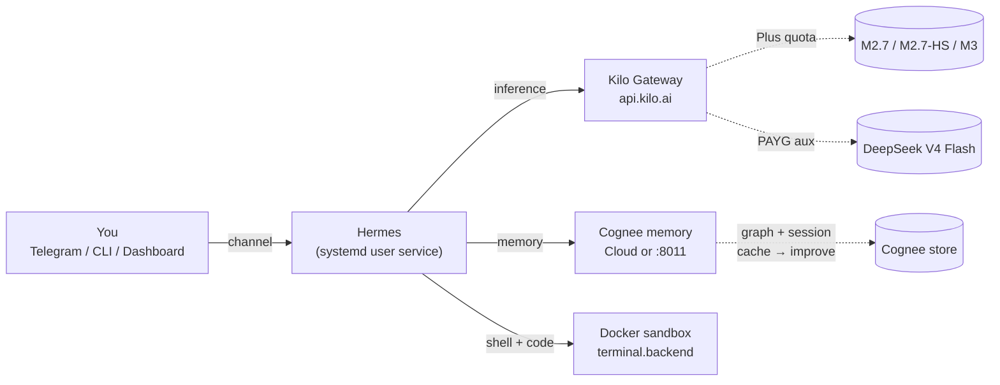

I’ll pull current Hermes, Cognee, and Kilo setup docs so the VPS guide matches how these pieces actually install and connect today.I have the install and Cognee plugin paths. Next I’ll pull official Hermes gateway, sandbox, profiles, and memory pages so the VPS runbook is accurate.# Hermes + Kilo + MiniMax Plus + Cognee — VPS implementation guide

This is a production runbook for a **new Linux VPS**: Hermes Agent as the runtime, **Kilo Gateway** as the only inference pipe, **MiniMax Token Plan Plus** for M2.7/M3, **DeepSeek V4 Flash** for auxiliary work, and **Cognee** as the external memory provider. Native Hermes memory and skills stay on. Cognee does not replace them.

Official install path: `curl -fsSL https://hermes-agent.nousresearch.com/install.sh | bash`. Official Cognee plugin lives under `~/.hermes/plugins/cognee` and is selected with `hermes memory setup`.

---

## 0. Architecture you are building



**Two different uses of Docker**

| Use | Do this? |
|---|---|
| Hermes *in* a container | Optional. More isolation, more friction for plugins. |
| Docker as **terminal backend** | **Yes on a VPS.** Agent runs on the host; shell/code tools run in a sandbox. |

This guide uses **host Hermes + Docker sandbox**. That is the cleanest path for the Cognee plugin, systemd, and `~/.hermes` backups.

---

## 1. VPS baseline

| Resource | Minimum | Comfortable |
|---|---|---|
| OS | Ubuntu 24.04 LTS | Ubuntu 24.04 |
| vCPU | 2 | 2–4 |
| RAM | 2 GB (API-only) | **4 GB** (gateway + Cognee local + Docker) |
| Disk | 20 GB SSD | 40 GB |
| Network | Public IPv4 | + firewall / Tailscale |

Do **not** run local LLMs on this box unless you sized for it (8 GB+). Inference is Kilo. Cognee Cloud remote mode needs almost no extra RAM; Cognee local needs 1–2 GB more.

**Create a dedicated user. Do not run Hermes as root.**

```bash
ssh root@YOUR_VPS_IP
apt update && apt upgrade -y
apt install -y curl git xz-utils ufw fail2ban ca-certificates gnupg
adduser --disabled-password --gecos "" hermes
usermod -aG sudo hermes
# Optional: copy your SSH key
mkdir -p /home/hermes/.ssh
cp /root/.ssh/authorized_keys /home/hermes/.ssh/
chown -R hermes:hermes /home/hermes/.ssh
chmod 700 /home/hermes/.ssh
chmod 600 /home/hermes/.ssh/authorized_keys
```

Firewall: SSH only until the gateway is locked down.

```bash
ufw default deny incoming
ufw default allow outgoing
ufw allow OpenSSH
ufw enable
```

Do **not** expose dashboard `9119` or gateway `8642` to the public internet. Use SSH tunnel or Tailscale later.

---

## 2. Docker (sandbox only)

```bash
# as root
curl -fsSL https://get.docker.com | sh
usermod -aG docker hermes
```

Log out and SSH back in **as `hermes`**.

```bash
docker run --rm hello-world
```

---

## 3. Install Hermes (per-user, not sudo)

As `hermes`:

```bash
curl -fsSL https://hermes-agent.nousresearch.com/install.sh | bash
echo 'export PATH="$HOME/.local/bin:$PATH"' >> ~/.bashrc
source ~/.bashrc
hermes --version
hermes doctor
```

Layout: code `~/.hermes/hermes-agent/`, binary `~/.local/bin/hermes`, data `~/.hermes/`. Root install puts data under `/root/.hermes` — avoid that on a VPS.

If Playwright browser deps are needed later:

```bash
sudo npx playwright install-deps chromium
```

Headless-only: installer flag `--skip-browser`.

---

## 4. Kilo + MiniMax Plus (inference)

### 4.1 Kilo account work (browser, not on the VPS)

1. Create / log in at [kilo.ai](https://kilo.ai).
2. Fund Kilo Credits.
3. Marketplace → **MiniMax Token Plan Plus** (~$20 / 30 days, ~1.7B tokens, 3–4 concurrent agents).
4. Confirm the plan includes **M2.7, M2.7-highspeed, and M3** on one quota bar.
5. Create a **Kilo Gateway API key**.

### 4.2 Point Hermes at Kilo

```bash
hermes model
```

Pick **Kilo Code** (`kilocode` / aliases `kilo`, `kilo-gateway`). Paste the key. It lands in `~/.hermes/.env` as `KILOCODE_API_KEY`.

Or write it yourself:

```bash
# ~/.hermes/.env
KILOCODE_API_KEY=kilo_...
```

```yaml
# ~/.hermes/config.yaml
model:
  provider: kilocode
  default: minimax/minimax-m2.7
```

Confirm slugs with Kilo’s catalog (`GET https://api.kilo.ai/api/gateway/models`) if a name drifts.

Smoke test:

```bash
hermes -m "Reply with exactly: kilo-ok"
```

---

## 5. Model plan (from this conversation)

M2.7 is the **default brain**. It was co-worked with Nous for skills, long skill files, and Hermes’ learning loop. Plus pays for M2.7/M3. Flash is separate PAYG.

| Profile | Main model | When |
|---|---|---|
| `hermes-m27` (default) | `minimax/minimax-m2.7` | Daily agent, skills, Cognee tools |
| `hermes-m27-fast` | `minimax/minimax-m2.7-highspeed` | Same, lower latency |
| `hermes-m3` | `minimax/minimax-m3` | Vision / video / sessions that will exceed ~200K |
| `hermes-flash` | `deepseek/deepseek-v4-flash` | MiniMax window/cap hit, cheap cron |

Auxiliary slots — always Flash except vision:

```yaml
auxiliary:
  compression:
    provider: kilocode
    model: deepseek/deepseek-v4-flash
  title_generation:
    provider: kilocode
    model: deepseek/deepseek-v4-flash
  approval:
    provider: kilocode
    model: deepseek/deepseek-v4-flash
  web_extract:
    provider: kilocode
    model: deepseek/deepseek-v4-flash
  vision:
    provider: kilocode
    model: minimax/minimax-m3

fallback_model: deepseek/deepseek-v4-flash
```

Create profiles after the default works:

```bash
hermes profile create hermes-m27-fast --clone-from default
hermes profile create hermes-m3 --clone-from default
hermes profile create hermes-flash --clone-from default
# then hermes model / config per profile
```

**Rules**

- Switch models at **session start**. Mid-session `/model` drops the prompt cache.
- M2.7 context is ~200K and **text-only**. Screenshots → `hermes-m3`.
- Plus 5-hour + weekly windows and 3–4 concurrent agents still apply. Fifth worker → Flash or wait.
- Do not use Flash as the daily main while Plus is idle.

---

## 6. Sandbox the shell (required on a VPS)

```bash
hermes config set terminal.backend docker
```

Example block:

```yaml
terminal:
  backend: docker
  docker_image: "nikolaik/python-nodejs:python3.11-nodejs20"
  container_cpu: 2
  container_memory: 2048
  container_persistent: true
  docker_volumes:
    - "/home/hermes/workspace:/workspace/projects"
  docker_forward_env: []
```

Create the workspace:

```bash
mkdir -p /home/hermes/workspace
hermes -m "Run pwd and ls -la in the sandbox and show output"
```

Leave `approval_mode` on **smart** or **confirm** until you trust the agent. Do not start with YOLO on a public VPS.

```bash
hermes tools
```

Disable tools you will not use (browser, WhatsApp, computer-use if headless).

---

## 7. Memory stack — native + Cognee

Hermes always keeps:

| Store | Path | Job | Size |
|---|---|---|---|
| Agent notes | `~/.hermes/memories/MEMORY.md` | Environment facts | ~2,200 chars |
| User profile | `~/.hermes/memories/USER.md` | You | ~1,375 chars |
| Session archive | `~/.hermes/state.db` | Full-text “last Tuesday” | Unbounded |
| Skills | `~/.hermes/skills/` | Procedures | Unbounded |
| **Cognee** | Cloud tenant or `~/.cognee` | Semantic / graph recall | Unbounded |

Only **one** external provider is active. Native files stay on beside it.

### 7.1 Which Cognee mode on a VPS

| Mode | Use if | Needs |
|---|---|---|
| **Remote / Cognee Cloud** | You want the VPS thin and reliable | `COGNEE_BASE_URL` + `COGNEE_API_KEY` |
| **Local server :8011** | Data must stay on the box | Extra RAM + an LLM key for *Cognee’s* extract/embed |
| **Embedded** | Avoid on a gateway VPS | Single-process only; unsafe with gateway + cron |

**Recommendation:** Cognee Cloud remote. Graph extraction then does not consume MiniMax Plus or fight Docker. Local mode is valid if you refuse a second SaaS — then give Cognee a cheap extract model (Kilo Flash via custom endpoint, or a small OpenAI-compatible key), not M2.7.

### 7.2 Install the Cognee plugin

Docs still show a git copy; the integrations README also documents pip + installer. Try pip first, fall back to copy.

```bash
# Prefer:
pip install cognee-integration-hermes-agent
cognee-hermes-install

# Fallback:
git clone https://github.com/topoteretes/cognee-integrations.git
mkdir -p ~/.hermes/plugins/cognee
cp -R cognee-integrations/integrations/hermes-agent/. ~/.hermes/plugins/cognee/
```

`pip install` alone is not enough. Hermes scans `~/.hermes/plugins/`. After upgrades, re-run `cognee-hermes-install`.

### 7.3 Activate Cognee

```bash
hermes memory setup
# select cognee
# Mode: remote  → tenant URL + API key
#   or local    → LLM_API_KEY for Cognee's own extractor
hermes memory status
hermes cognee status
```

Secrets go in `~/.hermes/.env`. Non-secrets in `~/.hermes/cognee.json`. JSON wins over env; change mode through the wizard so they stay aligned.

Remote `.env` fragment:

```bash
COGNEE_BASE_URL=https://YOUR-TENANT.aws.cognee.ai
COGNEE_API_KEY=ck_...
COGNEE_DATASET=hermes
COGNEE_TOP_K=5
COGNEE_IMPROVE_ON_END=true
```

Local-only extras:

```bash
LLM_API_KEY=...          # Cognee extractor, not Hermes
# optional custom extract model:
# LLM_PROVIDER=openai
# LLM_ENDPOINT=https://api.kilo.ai/api/gateway
# LLM_MODEL=deepseek/deepseek-v4-flash
```

Verify:

```bash
# local server only
curl -s http://127.0.0.1:8011/health
```

In a Hermes session:

```
Remember that this VPS workspace is /home/hermes/workspace and package manager is pnpm.
What is the workspace path?
```

End the session. With `COGNEE_IMPROVE_ON_END=true`, the session cache is promoted into the permanent graph. Tools the agent gets: `cognee_recall`, `cognee_remember`, `cognee_forget`. Circuit breaker trips if Cognee is down; Hermes keeps running on native memory.

### 7.4 What goes where (enforce this in USER.md)

| Cognee | MEMORY.md | Skill |
|---|---|---|
| Entities, decisions, “why Postgres” | “Workspace is ~/workspace. Use pnpm.” | Exact commands + verify steps |
| Cross-session project graph | Standing corrections | Multi-step playbooks |
| Outcomes / traces Cognee indexes | Always-on tool quirks | Agent-team procedures |

Do not copy Cognee dumps into `MEMORY.md`. Caps are real; overflow forces deletes. Files inject **once per session** (cache-stable).

Seed `USER.md` with one line after first chat: you use Kilo, default M2.7, Cognee for project recall, skills for procedures.

---

## 8. Hermes features to turn on (in this order)

### 8.1 Skills (procedural memory — M2.7’s home turf)

```bash
hermes skills opt-in --sync
```

After a real multi-step success, tell the agent to save a skill. M2.7 is the model that should write and follow those files. Do not write skills on Flash.

### 8.2 Messaging gateway (always-on VPS)

```bash
hermes gateway setup
# Telegram is the usual first channel
hermes gateway install
loginctl enable-linger hermes
systemctl --user enable --now hermes-gateway
systemctl --user status hermes-gateway
journalctl --user -u hermes-gateway -f
```

Without **linger**, the user service dies on SSH logout and will not start at boot. That is the #1 VPS footgun.

Pairing: only your account. Treat the bot token like a root password.

### 8.3 Cron / unattended jobs

Use Hermes cron for daily briefs, not a fifth always-on interactive session (Plus concurrency). Point unattended cheap jobs at `hermes-flash` if they are not skill-heavy.

### 8.4 Dashboard (optional, private)

Prefer:

```bash
ssh -L 9119:127.0.0.1:9119 hermes@YOUR_VPS
```

Do not `ufw allow 9119` on a public IP.

### 8.5 MCP

Add MCP servers in `config.yaml` only after the core loop works. Cognee is a **memory provider**, not a substitute for stuffing Cognee MCP next to the plugin (you can add MCP later for explicit remember/recall if you want both).

---

## 9. Target `config.yaml` (assembled)

Paths and key names vary slightly by Hermes version; `hermes config check` after paste.

```yaml
model:
  provider: kilocode
  default: minimax/minimax-m2.7

auxiliary:
  compression:
    provider: kilocode
    model: deepseek/deepseek-v4-flash
  title_generation:
    provider: kilocode
    model: deepseek/deepseek-v4-flash
  approval:
    provider: kilocode
    model: deepseek/deepseek-v4-flash
  web_extract:
    provider: kilocode
    model: deepseek/deepseek-v4-flash
  vision:
    provider: kilocode
    model: minimax/minimax-m3

fallback_model: deepseek/deepseek-v4-flash

memory:
  provider: cognee

terminal:
  backend: docker
  docker_image: "nikolaik/python-nodejs:python3.11-nodejs20"
  container_persistent: true
  docker_volumes:
    - "/home/hermes/workspace:/workspace/projects"

# keep approval conservative on first week
# approval_mode: smart
```

`.env` (mode 600):

```bash
chmod 600 ~/.hermes/.env
# KILOCODE_API_KEY
# COGNEE_BASE_URL / COGNEE_API_KEY   (remote)
# or LLM_API_KEY                     (Cognee local extract)
# TELEGRAM_BOT_TOKEN                 (if gateway)
```

---

## 10. systemd survival and updates

```bash
loginctl enable-linger hermes
systemctl --user enable --now hermes-gateway
hermes doctor
```

Updates:

```bash
hermes update          # prints the right command for git vs docker install
hermes config check
hermes config migrate  # if prompted
cognee-hermes-install  # if you installed Cognee via pip
hermes cognee status
```

Backup (credentials-aware):

```bash
hermes backup
# profile export does NOT include API keys — not a full DR copy
```

Also snapshot:

- `~/.hermes/` (config, memories, skills, state.db)
- `~/.cognee/` if local mode
- off-box: object storage or another VPS

---

## 11. Security checklist

- Dedicated `hermes` user, no root agent.
- `terminal.backend: docker`.
- Approval not YOLO until you have watched a week of traces.
- UFW: SSH only. Gateway/dashboard via Tailscale or SSH tunnel.
- `chmod 600 ~/.hermes/.env`.
- Unique Telegram pairing.
- Unattended data-training model tiers: leave default-deny.
- Do not bind-mount `/` or `$HOME` into the sandbox; mount `~/workspace` only.

---

## 12. Acceptance test (do this before you call it done)

1. `hermes doctor` clean.  
2. `hermes -m "kilo-ok"` returns from M2.7.  
3. Sandbox `ls` works inside Docker, not on `/root`.  
4. `hermes memory status` + `hermes cognee status` show Cognee.  
5. Store a fact, `/new`, recall it via Cognee.  
6. Complete a small multi-step task; confirm a skill file appeared.  
7. `MEMORY.md` still tiny.  
8. Reboot VPS; `systemctl --user status hermes-gateway` is active (linger).  
9. Telegram (if enabled) answers after reboot.  
10. Force a MiniMax failure (or set fallback) and confirm Flash answers.  
11. Open a **new** session on `hermes-m3`, send an image, get a description.

---

## 13. Daily operating model

You talk to the always-on gateway. Default profile is **M2.7 on Plus**. Cognee prefetches or is searched for project facts. Skills load for procedures. Flash compresses context and scores approvals. M3 is a separate session for eyes and oversized context. If MiniMax’s 5-hour window or agent cap trips, Flash keeps the process alive without killing Cognee or skills.

That is the stack, implemented: **VPS user + Docker sandbox + Kilo key + Plus on M2.7 + Cognee as the graph layer + Hermes skills/gateway as the product surface.**
