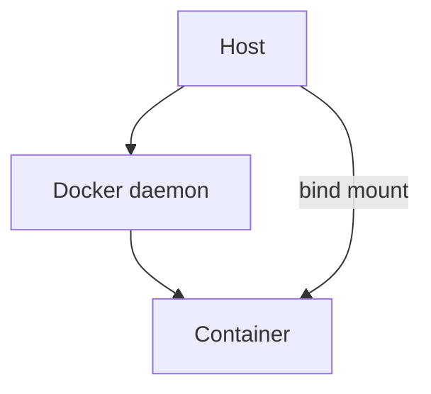

# Coding Specs

Conventions and rules for files in this project. Rules are numbered; append new rules to the bottom, never renumber.

---

## Rule 1 — Mermaid diagrams for LLM-ingested markdown

When a markdown file will be ingested by an LLM (agent context, system prompt, skill body, documentation indexed into Cognee, or any file passed via `Read`/`Grep` to a model), include a **Mermaid diagram** for any non-trivial structure — system topology, data flow, state machine, file relationships, decision tree, sequence, ER, or class layout.

### Why

Mermaid is far more token-efficient than prose or ASCII art for structural information, and LLMs already parse Mermaid natively:

| Form | Approx. tokens for a 6-node topology | LLM-parsable structure |
|---|---|---|
| ASCII box diagram | ~250–400 | No — visual only |
| Prose description | ~300–500 | Partial |
| Mermaid `graph TD` | ~60–90 | Yes — nodes, edges, labels are semantic |

Less context spent on layout means more context for the actual task. Mermaid also renders in Kilo, GitHub, Obsidian, and most LLM UIs without preprocessing.

### When this applies

- ✅ `references/*.md` files describing systems, specs, or relationships
- ✅ `convos/*.md` summaries that will be re-read by agents
- ✅ Skill files that document multi-step flows
- ✅ Any markdown that captures a **topology, flow, sequence, or schema**
- ❌ Short notes, status updates, change logs — prose is fine
- ❌ Markdown intended only for human eyeballs and never re-ingested

### Pattern

Open the file with a Mermaid block near the top, before prose, so the model sees structure first:

Follow the diagram with prose that names the components and explains flows. Do not duplicate the diagram in prose — let the diagram carry the structure.

### Syntax rules

- Use simple shapes: `[]`, `()`, `{}`, `>(()))`. Avoid `[/parallelogram/]` and `[\trapezoid\]` unless required.
- Label edges with `-->|verb|` so flows are machine-readable.
- Group with `subgraph` for subsystems.
- Keep one diagram per concept. Split rather than nest `graph TD` inside a node.
- No HTML inside Mermaid blocks; not all renderers support it.

### Reference example

`references/system-diagram.md` (container-first dev topology) and the architecture diagram in `convos/minimax-playbook-hermes.md` §0 are being converted to Mermaid under this rule. When converting an existing ASCII diagram, replace it (do not append alongside) and archive the ASCII version only if it carries information the Mermaid cannot express — almost always it does not.