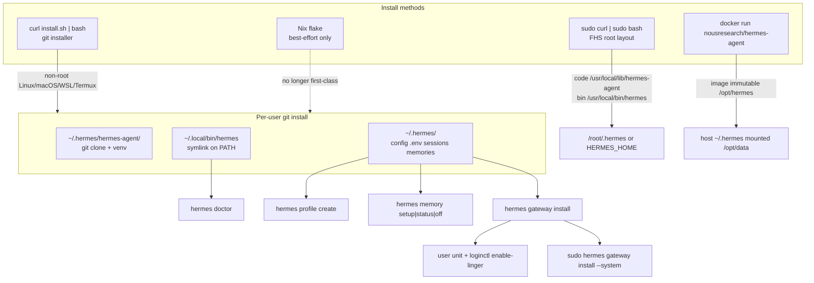
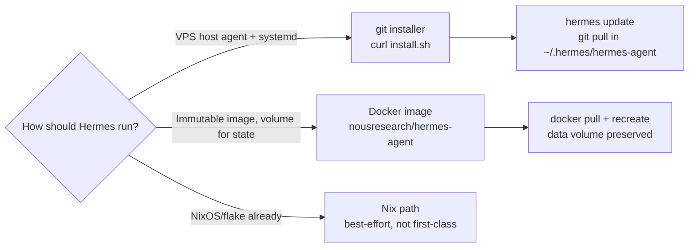
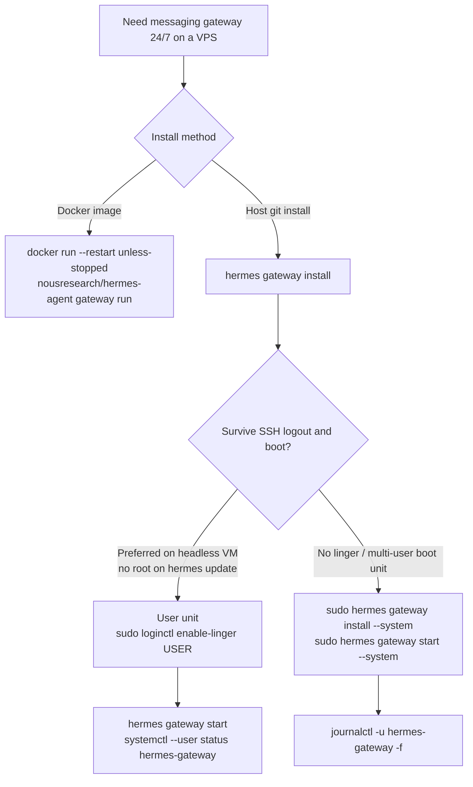

# Hermes install, profile CLI, memory CLI, gateway linger

Research snapshot for Wayfinder ticket #21. Facts below are from official Hermes sources on **2026-08-31**, against the **0.20.6** release line (`v2026.8.27`, `pyproject.toml` `version = "0.20.6"`). `hermes` was **not** on PATH in this research environment, so CLI `--help` was not executed locally; flags are taken from the published CLI reference, profile docs, and `install.sh`.

**Do not treat `convos/minimax-playbook-hermes.md` as authority.** Corrections vs that playbook are in [Playbook drift](#playbook-drift).



## Sources

| Source | URL |
|---|---|
| Website install | https://hermes-agent.nousresearch.com/docs/getting-started/installation |
| Official installer | https://hermes-agent.nousresearch.com/install.sh |
| GitHub README | https://github.com/NousResearch/hermes-agent/blob/main/README.md |
| CLI reference | https://hermes-agent.nousresearch.com/docs/reference/cli-commands |
| Profile commands | https://hermes-agent.nousresearch.com/docs/reference/profile-commands |
| Profiles user guide | https://hermes-agent.nousresearch.com/docs/user-guide/profiles |
| Memory providers | https://hermes-agent.nousresearch.com/docs/user-guide/features/memory-providers |
| Built-in memory | https://hermes-agent.nousresearch.com/docs/user-guide/features/memory |
| Messaging gateway | https://hermes-agent.nousresearch.com/docs/user-guide/messaging |
| Docker | https://hermes-agent.nousresearch.com/docs/user-guide/docker |
| Updating | https://hermes-agent.nousresearch.com/docs/getting-started/updating |
| Release 0.20.6 | https://github.com/NousResearch/hermes-agent/releases/tag/v2026.8.27 |
| Bundled memory plugins | https://github.com/NousResearch/hermes-agent/tree/main/plugins/memory |
| Package version | https://github.com/NousResearch/hermes-agent/blob/main/pyproject.toml |

---

## 1. Current install path

### 1.1 Official URL

Linux / macOS / WSL2 / Termux (website, README, and the installer header):

```bash
curl -fsSL https://hermes-agent.nousresearch.com/install.sh | bash
```

Windows native:

```powershell
iex (irm https://hermes-agent.nousresearch.com/install.ps1)
```

The installer help text documents extra flags via `bash -s -- …`, including `--skip-setup`, `--skip-browser`, `--skip-computer-use`, `--no-skills`, `--branch`, `--dir`, `--hermes-home`. Headless VPS without Playwright: `bash -s -- --skip-browser`.

The GitHub **release notes** for `v2026.8.27` also show a raw-GitHub one-liner (`https://raw.githubusercontent.com/NousResearch/hermes-agent/main/scripts/install.sh`). Treat **hermes-agent.nousresearch.com/install.sh** as the user-facing canonical URL (README, docs, script header).

### 1.2 Layout: `~/.hermes` vs `~/.local/bin/hermes`

From the official install-layout table:

| Installer | Code | `hermes` binary | Data |
|---|---|---|---|
| Per-user (git installer) | `~/.hermes/hermes-agent/` | `~/.local/bin/hermes` (symlink) | `~/.hermes/` |
| Root-mode (`sudo curl … \| sudo bash`) | `/usr/local/lib/hermes-agent/` | `/usr/local/bin/hermes` | `/root/.hermes/` (or `$HERMES_HOME`) |

`install.sh` defaults:

- `HERMES_HOME="${HERMES_HOME:-$HOME/.hermes}"`
- Non-root: `INSTALL_DIR="$HERMES_HOME/hermes-agent"`, command link dir `$HOME/.local/bin`
- Root on Linux (new install, no legacy checkout): FHS at `/usr/local/lib/hermes-agent` + `/usr/local/bin/hermes`; data still `$HERMES_HOME`
- Termux: code stays under `$HERMES_HOME/hermes-agent`; command link in `$PREFIX/bin`

The git installer **clones** `NousResearch/hermes-agent` (SSH then HTTPS fallback, default branch `main`) into that code dir, creates a venv, and installs the `hermes` launcher. Reload the shell (`source ~/.bashrc`) so `~/.local/bin` is on PATH.

Service-account PATH trap: many systemd users omit `~/.local/bin`. Docs give two fixes:

```bash
echo 'export PATH="$HOME/.local/bin:$PATH"' >> ~/.bashrc
# or, as admin:
sudo ln -s /home/hermes/.hermes/hermes-agent/venv/bin/hermes /usr/local/bin/hermes
```

Invoking the **repo source file** `~/.hermes/hermes-agent/hermes` with system Python (instead of the venv launcher) produces `ModuleNotFoundError: No module named 'dotenv'`.

Default-profile data that lives under `~/.hermes/` (not the checkout) includes `config.yaml`, `.env`, `SOUL.md`, `sessions/`, `memories/`, `skills/`, `cron/`, `hooks/`, `logs/`, `state.db`. Named profiles live at `~/.hermes/profiles/<name>/`. The default profile **is** `~/.hermes` itself.

### 1.3 Git installer vs Docker vs Nix



- **Git installer (recommended host path):** clones the repo, stamps the install method, wires `hermes update`. Docs call this the “git installer.” Detection is by layout (`~/.hermes/hermes-agent/` checkout), not an env var.
- **Docker:** run the agent **in** the image `nousresearch/hermes-agent`. Host `~/.hermes` bind-mounts to `/opt/data`. Code is immutable at `/opt/hermes`. Gateway: `docker run … nousresearch/hermes-agent gateway run`. This is a different install method from “Docker as `terminal.backend`” (sandbox for tool calls while Hermes stays on the host).
- **Nix:** “no longer an explicitly supported install path (best-effort only).”
- **Manual clone:** contributing docs; venv should live **outside** the source tree (`~/.hermes/venvs/hermes-dev`). Prefer the standard installer even for contributors.

`hermes update` prints the matching update command for git / Docker / NixOS based on detected layout.

### 1.4 `hermes doctor`

CLI reference:

```bash
hermes doctor [--fix]
```

- Diagnoses config and dependency issues.
- `--fix` attempts automatic repairs where possible.
- After a non-sudo / service-user install, docs say **`hermes doctor` should run cleanly**.
- After `hermes update`, recommended validation includes `hermes doctor` (config, dependencies, service health).
- Surfaces the detected install method under its environment summary.
- Distinct from `hermes dump` (shareable setup summary) and `hermes status` (visual overview).

Related: `hermes hooks doctor`, `hermes plugins doctor`, `hermes pets doctor`, `hermes computer-use doctor` are other commands; they are not the top-level installer check.

---

## 2. Profile commands — `hermes profile create` flags

Release-line surface (profile commands reference + profiles user guide):

```bash
hermes profile create <name> [options]
```

| Flag | Meaning |
|---|---|
| `<name>` | Directory-safe name (alphanumeric, hyphens, underscores). Becomes `~/.hermes/profiles/<name>/` and (unless `--no-alias`) a wrapper at `~/.local/bin/<name>`. |
| `--clone` | Copy `config.yaml`, `.env`, `SOUL.md`, and skills from the **current** profile. Fresh sessions and memory. |
| `--clone-all` | Copy everything from the current profile (config, keys, personality, memories, skills, cron, plugins). **Excludes** per-profile history: sessions, `state.db`, `backups/`, `state-snapshots/`, `checkpoints/`. |
| `--clone-from <profile>` | Source profile instead of current. **Implies `--clone`** unless paired with `--clone-all`. |
| `--no-alias` | Skip wrapper script. |
| `--description "<text>"` | Role blurb for kanban routing; stored in `<profile_dir>/profile.yaml`. |
| `--no-skills` | Empty profile, writes `.no-bundled-skills`. **Refuses** combination with `--clone`, `--clone-from`, or `--clone-all`. |

Examples from the reference:

```bash
hermes profile create mybot
hermes profile create work --clone
hermes profile create backup --clone-all
hermes profile create work2 --clone-from work
hermes profile create work2-backup --clone-from work --clone-all
```

There is **no** lone `--clone-from` “full copy” without `--clone-all`; `--clone-from` alone is config/skills/SOUL (plus `.env` per `--clone` semantics).

Also on this line (not asked, for orientation): `list`, `use`, `describe`, `delete`, `show`, `alias`, `rename`, `export`, `import`, `install` (git distribution), `update`, `info`. Global `-p` / `--profile` selects a profile for one invocation.

Per-profile gateway units: `coder gateway install` → `hermes-gateway-coder` (systemd/launchd). Default home uses `hermes-gateway`.

---

## 3. Memory CLI — existence and meaning only

```bash
hermes memory setup      # interactive provider picker + configuration
hermes memory status     # show current memory provider config
hermes memory off        # disable the external provider (built-in only)
```

These three subcommands exist on the current CLI reference and memory-providers page.

Meaning:

- They manage **external memory provider plugins**, not the built-in `MEMORY.md` / `USER.md` stores.
- **Only one** external provider can be active (`memory.provider` in `config.yaml`; empty = built-in only).
- The CLI reference states built-in memory is **always active alongside** an external provider. Turning built-in stores off is a **config** concern (`memory.memory_enabled` / `memory.user_profile_enabled`), not `hermes memory off`.
- `hermes memory off` = disable the **external** plugin.

Bundled providers on this line (CLI list + `plugins/memory/` on `main`): **honcho, openviking, mem0, hindsight, holographic, retaindb, byterover, supermemory**. Docs also describe **Memori** via a separate `hermes-memori` package. Active providers may register `hermes <provider>` (e.g. `hermes honcho`) only while selected.

**Cognee is not a bundled provider** in `plugins/memory/` or the official provider list. Selecting memory with `hermes memory setup` will not offer Cognee unless a user-dropped plugin exists. That is a later ticket.

---

## 4. Gateway linger / systemd notes a VPS still needs

Host git-install on Linux still needs an explicit always-on story. Docker `--restart unless-stopped` is a different path (no linger).



### What the VPS still needs (host install)

1. **Do not run the git installer as root** if the goal is a dedicated `hermes` user. Root-mode puts data under `/root/.hermes`.
2. **Git + curl + xz-utils** on Debian/Ubuntu. Optional: `sudo npx playwright install-deps chromium` once if browser tools are required; otherwise `--skip-browser`.
3. **`~/.local/bin` on PATH** for the service user.
4. **Install and start a service**, not a foreground `hermes gateway` in an SSH session:
   ```bash
   hermes gateway install
   hermes gateway start
   ```
5. **Linger if using the user unit** (the default `hermes gateway install`):
   ```bash
   sudo loginctl enable-linger $USER   # or the service account name
   ```
   Official install docs: a user-level service **stops at logout and does not start at boot** until linger is enabled. Messaging docs: linger “keeps running after logout.”
6. **Or** skip linger with a system unit that still runs as the user:
   ```bash
   sudo hermes gateway install --system
   sudo hermes gateway start --system
   ```
   Messaging docs: user service for laptops/dev boxes; system service for VPS/headless hosts that should come back at boot **without** linger.
7. **Headless-VM nuance (same page):** a system unit needs root for every restart, including the automatic restart at the end of `hermes update`. For a box you rarely log into, **user service + linger** gives start-at-boot with no root on update. If you keep `--system`, either `sudo hermes update` or passwordless sudo limited to `systemctl` on `hermes-gateway*`.
8. **Do not keep both** user and system gateway units unless intentional; Hermes warns because start/stop/status become ambiguous.
9. **Do not add** an `ExecStopPost=/bin/kill -9 $MAINPID` drop-in; that loops restarts.
10. **Per-profile:** each profile can `gateway install` its own unit (`hermes-gateway-<profile>`). Non-default `HERMES_HOME` uses `hermes-gateway-<hash>`.
11. **WSL:** docs say use `hermes gateway run` (optionally under tmux); WSL systemd is unreliable. Not the Contabo/VPS case.
12. **Logs:** user unit `journalctl --user -u hermes-gateway -f`; system unit `journalctl -u hermes-gateway -f`.

Prerequisite from the service-user install section: linger is **in addition to** the unit, not a substitute for `hermes gateway install`.

---

## Playbook drift

Checked against `convos/minimax-playbook-hermes.md`; **do not copy these playbook claims forward**.

| Playbook / older note | Official now |
|---|---|
| Official Cognee plugin at `~/.hermes/plugins/cognee`, selected with `hermes memory setup` | **No bundled Cognee provider.** `hermes memory setup` picks honcho / openviking / mem0 / hindsight / holographic / retaindb / byterover / supermemory (Memori is a separate package). |
| Install one-liner | **Still correct:** `curl -fsSL https://hermes-agent.nousresearch.com/install.sh \| bash` |
| Layout code / bin / data | **Still correct** for per-user git install |
| `hermes doctor` after install | **Still correct** |
| systemd user service as the VPS story | Incomplete: linger **or** `--system`; official headless tip prefers **user + linger** so `hermes update` can restart without root |
| Docker vs git | Two Docker roles: **image** (agent in container) vs **`terminal.backend: docker`** (sandbox). Git installer is the host-agent path. |

---

## VPS host-install checklist (current line)

```bash
# as unprivileged user, not root
curl -fsSL https://hermes-agent.nousresearch.com/install.sh | bash
# optional: bash -s -- --skip-browser
echo 'export PATH="$HOME/.local/bin:$PATH"' >> ~/.bashrc
source ~/.bashrc
hermes doctor
hermes setup          # or hermes setup --portal
hermes gateway setup
hermes gateway install
sudo loginctl enable-linger "$USER"
hermes gateway start
hermes gateway status

# profiles
hermes profile create research --clone-from default --description "…"
# memory (external plugin; another ticket chooses the provider)
hermes memory setup
hermes memory status
# hermes memory off   # drop external provider; built-in files remain
```
