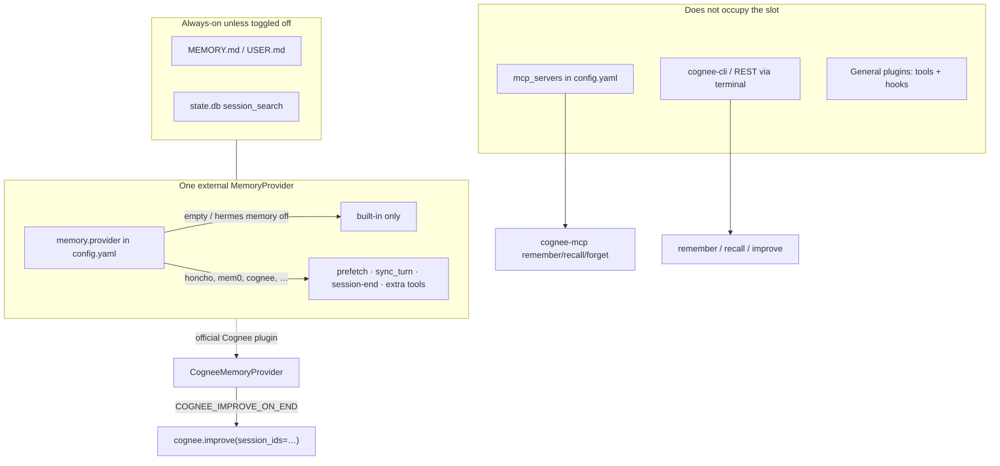

# Hermes memory provider slot (current docs and source)

Research against official Hermes and Cognee docs plus first-party source. Not an authority: `convos/minimax-playbook-hermes.md`, `convos/memory-hermes.md`. Checked: 2026-08-31.

## 1. `hermes memory off` / `status` / `setup`

### Still one external provider

Official Memory Providers page: Hermes ships bundled external providers; **only one external provider can be active at a time**; built-in MEMORY.md / USER.md is **always active alongside** it.

- Source: [Memory Providers](https://hermes-agent.nousresearch.com/docs/user-guide/features/memory-providers) — “Only **one** external provider can be active at a time — the built-in memory is always active alongside it.”
- Same wording in CLI help: [CLI Commands — `hermes memory`](https://hermes-agent.nousresearch.com/docs/reference/cli-commands) — “Only one external provider can be active at a time. Built-in memory (MEMORY.md/USER.md) is always active.”
- Developer guide: [Memory Provider Plugins — Single Provider Rule](https://hermes-agent.nousresearch.com/docs/developer-guide/memory-provider-plugin) — “Only **one** external memory provider can be active at a time. If a user tries to register a second, the MemoryManager rejects it with a warning.”
- Source code: [`agent/memory_manager.py`](https://github.com/NousResearch/hermes-agent/blob/main/agent/memory_manager.py) — “Only ONE external plugin provider is allowed at a time”; `add_provider()` rejects a second non-`builtin` provider and logs to configure via `memory.provider`.
- Source code: [`plugins/memory/__init__.py`](https://github.com/NousResearch/hermes-agent/blob/main/plugins/memory/__init__.py) — “Only ONE provider can be active at a time, selected via `memory.provider` in config.yaml.” Discovery enumerates; activation is by that name.

Empty string in config is the documented “built-in only” value:

- [Plugins](https://hermes-agent.nousresearch.com/docs/user-guide/features/plugins) — `memory.provider` “empty string = built-in only”.

Bundled list is closed. Cognee is **not** one of the in-tree names (honcho, openviking, mem0, hindsight, holographic, retaindb, byterover, supermemory; docs also list Memori as a pip-installed provider). New backends must be standalone plugins.

- [CONTRIBUTING.md](https://github.com/NousResearch/hermes-agent/blob/main/CONTRIBUTING.md) — “We are no longer accepting new memory providers into this repo.”

### What the three commands do

Parser (`hermes_cli/subcommands/memory.py`): `setup` (optional provider name), `status`, `off` (“Disable external provider (built-in only)”), `reset` (erase MEMORY.md / USER.md, not the external slot).

**`hermes memory setup`**

- Interactive curses picker of discovered MemoryProvider plugins plus a final “Built-in only” row.
- Choosing a provider: installs declared pip deps, then either the provider’s `post_setup()` wizard or a generic schema walk; writes `memory.provider: <name>` to `config.yaml`; secrets to `.env`; non-secrets via `save_config()`.
- Choosing “Built-in only”: sets `memory.provider` to `""` and saves.
- `hermes memory setup <name>` skips the picker (`cmd_setup_provider`).
- Source: [`hermes_cli/memory_setup.py`](https://github.com/NousResearch/hermes-agent/blob/main/hermes_cli/memory_setup.py).
- Docs: [Memory Providers — Quick Start](https://hermes-agent.nousresearch.com/docs/user-guide/features/memory-providers). Alternate UI: `hermes plugins` → Provider Plugins → Memory Provider.

**`hermes memory status`**

- Prints built-in injection flags (`memory_enabled`, `user_profile_enabled`), whether the built-in `memory` tool is enabled for CLI, `Provider: <name or '(none — built-in only)'>`, plugin installed/available, missing env vars, and installed plugins with an “active” marker.
- Source: `cmd_status` in [`hermes_cli/memory_setup.py`](https://github.com/NousResearch/hermes-agent/blob/main/hermes_cli/memory_setup.py).

**`hermes memory off`**

- Loads `config.yaml`, ensures `memory:` exists, sets `memory.provider` to `""`, saves. Prints “Memory provider: built-in only”.
- Does **not** delete `cognee.json`, provider JSON, or `.env` keys. Does **not** disable MEMORY.md / USER.md.
- Source: `cmd_memory` in [`hermes_cli/main.py`](https://github.com/NousResearch/hermes-agent/blob/main/hermes_cli/main.py) (`if sub == "off": … config["memory"]["provider"] = ""`).

### Built-in vs external (do not confuse `off` with killing MEMORY.md)

External providers run **alongside** built-in files, not instead of them, unless you separately turn the files off.

- [Persistent Memory](https://hermes-agent.nousresearch.com/docs/user-guide/features/memory) — providers “run **alongside** built-in memory (never replacing it)”.
- Same page: both `memory_enabled` and `user_profile_enabled` false drops the built-in `memory` tool; `memory.provider` is **unaffected**. Listing `memory` under `agent.disabled_toolsets` also hides **external provider tools**.

When a provider is active, Hermes: injects provider context, prefetches before turns, syncs turns after responses, extracts on session end if the provider supports it, mirrors built-in memory writes, adds provider tools. ([Memory Providers — How It Works](https://hermes-agent.nousresearch.com/docs/user-guide/features/memory-providers).)

Provider-specific CLIs such as `hermes cognee …` register **only while that provider is active**. ([CLI Commands](https://hermes-agent.nousresearch.com/docs/reference/cli-commands); [`discover_plugin_cli_commands()`](https://github.com/NousResearch/hermes-agent/blob/main/plugins/memory/__init__.py).)

---

## 2. Cognee from Hermes without occupying the slot

Three different products. Only one is the MemoryProvider.

### Official Cognee Hermes plugin = occupies the slot

Official integration is a **drop-in MemoryProvider**. Install + `hermes memory setup` → select `cognee`. That writes `memory.provider: cognee`.

- [Hermes Agent integration](https://docs.cognee.ai/integrations/hermes-agent-integration) — “drop-in Cognee memory provider plugin”; install into `~/.hermes/plugins/cognee/` then `hermes memory setup`.
- [Cognee Cloud — Hermes](https://docs.cognee.ai/cognee-cloud/agent-integrations/hermes) — same picker step.
- [integrations/hermes-agent/README.md](https://github.com/topoteretes/cognee-integrations/blob/main/integrations/hermes-agent/README.md) — “Standalone Hermes memory provider backed by Cognee”; class is `CogneeMemoryProvider(MemoryProvider)` with `name == "cognee"` ([`provider.py`](https://github.com/topoteretes/cognee-integrations/blob/main/integrations/hermes-agent/cognee_integration_hermes/provider.py)).
- Copying files into `~/.hermes/plugins/cognee` does **not** activate the slot. Hermes memory discovery enumerates; nothing is the active backend until `memory.provider` names it. ([Memory Provider Plugins — Installation Layouts](https://hermes-agent.nousresearch.com/docs/developer-guide/memory-provider-plugin).)

While Cognee is the provider, Hermes auto-prefetches, auto-syncs each turn into Cognee session cache, exposes `cognee_*` tools, and (by default) runs `improve()` at session end. That **is** occupying the slot. You cannot have that lifecycle and keep `memory.provider` empty.

### MCP = tools, not the slot

Cognee documents Hermes as an **MCP client**, config at `~/.hermes/config.yaml` (YAML `mcp_servers`), same family as Claude Desktop / Cursor.

- [Cognee Cloud UI — Integrations](https://docs.cognee.ai/cognee-cloud/ui/integrations) — table: Hermes Agent → `~/.hermes/config.yaml` (YAML); MCP-based cards register Cognee as an MCP server (`uvx cognee-mcp` + `COGNEE_BASE_URL` / `COGNEE_API_KEY`).
- [Cloud MCP](https://docs.cognee.ai/cognee-cloud/connections/cloud-mcp) — any MCP-compatible client; tools `remember`, `recall`, `forget`.
- Hermes MCP is a separate config surface from `memory.provider`: [MCP](https://hermes-agent.nousresearch.com/docs/user-guide/features/mcp) — servers under `mcp_servers`; tools registered as `mcp_<server>_<tool>`; not mentioned as MemoryProviders.

Implication: `mcp_servers.cognee` plus `hermes memory off` is a documented pairing. The model must **call** MCP tools. There is no Hermes MemoryProvider prefetch / `sync_turn` / session-end `improve()` unless the Cognee plugin is also the active provider.

Hermes MCP sampling exists ([MCP — Sampling](https://hermes-agent.nousresearch.com/docs/user-guide/features/mcp)). Cognee’s hermes plugin docs mention `LLM_PROVIDER="mcp-sampling"` as a **different** setup from the memory provider plugin ([Hermes Agent integration — Authentication](https://docs.cognee.ai/integrations/hermes-agent-integration)).

### CLI = out of process, not the slot

- [Cognee CLI](https://docs.cognee.ai/cognee-cli/overview) — `cognee-cli remember|recall|improve|forget|…`, including `--api-url` against a running API / Cloud tenant. Independent of Hermes.
- Hermes can invoke it through the terminal tool like any other CLI. That does not set `memory.provider`.

### General plugin vs MemoryProvider

Hermes distinguishes **general plugins** (multi-select, `plugins.enabled`) from **memory providers** (single-select, `memory.provider`). ([Plugins — Plugin types](https://hermes-agent.nousresearch.com/docs/user-guide/features/plugins).)

A custom general plugin could register Cognee-backed tools/hooks without implementing `MemoryProvider`. That is **not** Cognee’s shipped Hermes integration, which subclasses `MemoryProvider` and is selected with `hermes memory setup`.

---

## 3. What `COGNEE_IMPROVE_ON_END` does when Cognee **is** the provider

This is the session-end graph promotion the stack is refusing.

### Flag

| Setting | Env | Default |
|---|---|---|
| `improve_on_end` | `COGNEE_IMPROVE_ON_END` | `true` |

- Cognee docs: [Hermes Agent integration — Configuration](https://docs.cognee.ai/integrations/hermes-agent-integration) — “Run `improve()` at session end”.
- Plugin README table and `config.py`: [`COGNEE_IMPROVE_ON_END`](https://github.com/topoteretes/cognee-integrations/blob/main/integrations/hermes-agent/README.md).
- Setup schema: “Run Cognee improve() when a Hermes session ends” ([`provider.py` `get_config_schema`](https://github.com/topoteretes/cognee-integrations/blob/main/integrations/hermes-agent/cognee_integration_hermes/provider.py)).

### Runtime (provider)

While Cognee is active:

1. **Per turn** — `sync_turn` writes the user/assistant pair into Cognee **session** memory (`remember_session`, session id like `hermes_<session>`).
2. **Prefetch** — background `cognee_recall` (session-first / layered) into the next turn.
3. **Explicit tools** — `cognee_remember` (permanent graph), `cognee_recall`, `cognee_forget`, plus dataset/code tools in current plugin source.
4. **`on_session_end`** — if initialized, writes enabled, **`_improve_on_end`**, breaker closed: deferred retired-session bridges, then either a **detached worker** (`improve` then unregister) or in-process `_improve_inline()`, which calls `backend.improve(dataset=…, session_ids=[cognee_session_id], …)`.
5. Crash insurance: exit watcher is armed with `improve=bool(writes_enabled and improve_on_end)`.
6. `on_memory_write` mirrors successful built-in MEMORY.md/USER.md **add/replace** into Cognee. Plugin README: also **steers** the model to prefer Cognee over Hermes’ files (`memory_steer`, default true).

If `COGNEE_IMPROVE_ON_END=false`, session cache still receives turns; the session-end (and watcher) **promote/bridge** is skipped.

`COGNEE_IMPROVE_BACKGROUND` (default `auto`): with a server, hand off close so Hermes does not wait on the graph build; embedded runs `improve()` in-process. README: local server uses `COGNEE_AGENT_MODE=true` and retires ~60s after last unregister, so improve must finish **before** unregister.

### What Cognee `improve(session_ids=…)` is

[Improve](https://docs.cognee.ai/core-concepts/main-operations/improve):

- Without session IDs: enrichment pass on an existing dataset (derived retrieval structures; not first-time graph create).
- **With `session_ids`**: apply feedback weights; persist session Q&A (`user_sessions_from_cache`); persist agent traces; extract/distill gated guidance into `session_learnings`; optional truth subspace; enrichment; optional global context index; sync new graph context back into session cache.

Hermes plugin How-it-works (docs): prefetch → capture turns in session cache → at session end with the flag, `cognee.improve(session_ids=[...])` promotes that cache into the permanent graph.

Docs drift: hosted integration pages still show default dataset `hermes` / `COGNEE_DATASET`. Current plugin README defaults dataset to shared `agent_sessions` (`COGNEE_PLUGIN_DATASET`) and local port `8011`. The flag’s meaning (session-end `improve()`) is the same in both.

---

## Answers (ticket questions)

1. **`off` / `status` / `setup`:** `setup` picks exactly one MemoryProvider (or built-in only) and writes `memory.provider`. `status` reports built-in flags plus that name. `off` sets `memory.provider` to `""` (built-in only); it does not wipe provider files or MEMORY.md. **The one-external-MemoryProvider rule is still documented and enforced in MemoryManager.**
2. **Cognee without the slot:** **CLI** (`cognee-cli`) and **MCP** (`mcp_servers` in `~/.hermes/config.yaml`) are first-party paths that do not set `memory.provider`. They are model- or operator-invoked tools, not auto session capture. The **official Cognee Hermes plugin is a MemoryProvider** and occupies the slot when selected. Installing the plugin tree idle does not occupy the slot; selecting it in `hermes memory setup` does.
3. **`COGNEE_IMPROVE_ON_END` (when Cognee is provider):** default **true**. At Hermes session end it runs Cognee **`improve()` for that session id**, bridging the per-turn session cache (and traces/Q&A/distilled lessons per Cognee’s improve spec) into the **permanent knowledge graph**. That automatic session-transcript promotion is what leaving the slot empty refuses.

## Citations

| URL | What it claims |
|---|---|
| https://hermes-agent.nousresearch.com/docs/user-guide/features/memory-providers | One external provider; `setup` / `status` / `off`; additive lifecycle (prefetch, sync, session-end, mirror, tools); bundled provider list. |
| https://hermes-agent.nousresearch.com/docs/user-guide/features/memory | Built-in MEMORY.md/USER.md + FTS; providers alongside, not replacing; how to disable built-in vs provider tools. |
| https://hermes-agent.nousresearch.com/docs/developer-guide/memory-provider-plugin | Discovery sources; MemoryProvider ABC; single-provider rule; `memory.provider` activation. |
| https://hermes-agent.nousresearch.com/docs/reference/cli-commands | `hermes memory` subcommands; empty provider = built-in only; provider CLIs only when active. |
| https://hermes-agent.nousresearch.com/docs/user-guide/features/plugins | General vs exclusive memory plugins; `memory.provider: ""`. |
| https://hermes-agent.nousresearch.com/docs/user-guide/features/mcp | `mcp_servers` independent of memory; tool prefix `mcp_<server>_<tool>`. |
| https://github.com/NousResearch/hermes-agent/blob/main/hermes_cli/main.py | `hermes memory off` writes `memory.provider: ""`. |
| https://github.com/NousResearch/hermes-agent/blob/main/hermes_cli/memory_setup.py | `setup` picker + “Built-in only”; `status` output. |
| https://github.com/NousResearch/hermes-agent/blob/main/agent/memory_manager.py | Rejects a second external provider. |
| https://github.com/NousResearch/hermes-agent/blob/main/plugins/memory/__init__.py | Name-based activation; CLI commands only for the active provider. |
| https://github.com/NousResearch/hermes-agent/blob/main/CONTRIBUTING.md | In-tree memory providers closed; Cognee-class backends are standalone plugins. |
| https://docs.cognee.ai/integrations/hermes-agent-integration | Official plugin is a MemoryProvider; `COGNEE_IMPROVE_ON_END`; prefetch/capture/promote. |
| https://docs.cognee.ai/cognee-cloud/agent-integrations/hermes | Cloud install still uses `hermes memory setup` → cognee. |
| https://docs.cognee.ai/cognee-cloud/ui/integrations | Hermes listed as MCP client (`~/.hermes/config.yaml`). |
| https://docs.cognee.ai/cognee-cloud/connections/cloud-mcp | MCP tools remember / recall / forget. |
| https://docs.cognee.ai/cognee-cli/overview | Independent `cognee-cli` remember/recall/improve. |
| https://docs.cognee.ai/core-concepts/main-operations/improve | `improve(session_ids=)` bridges session Q&A, traces, distilled lessons into the graph. |
| https://github.com/topoteretes/cognee-integrations/blob/main/integrations/hermes-agent/README.md | Plugin behavior, `COGNEE_IMPROVE_ON_END`, detached improve-then-unregister, memory steer. |
| https://github.com/topoteretes/cognee-integrations/blob/main/integrations/hermes-agent/cognee_integration_hermes/provider.py | `on_session_end` gated on `_improve_on_end`; `improve(session_ids=[…])`. |
