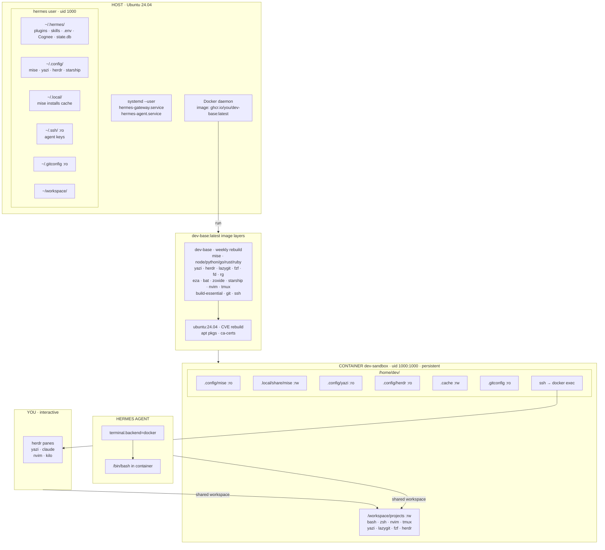

# System Diagram — Container-First Dev Topology

## Key flows

- **Workspace** is the single shared filesystem between you and Hermes (`/home/hermes/workspace` on host → `/workspace/projects` in container).
- **Configs** flow host → container read-only so a container rebuild never loses your settings.
- **Caches** (mise installs, cargo, pnpm) flow host ← container read-write so installs survive recreation.
- **Hermes never sees `~/.hermes/` mounted into the sandbox** — Cognee and Kilo creds stay on the host, injected by Hermes itself.
- **You and Hermes share the same image and same UID**, so `pnpm install` and `cargo build` produce files you both own.

## Related

- Source analysis: `../convos/minimax-playbook-hermes.md`
- Coding rules: `coding-specs.md` Rule 1 (Mermaid for LLM-ingested markdown)