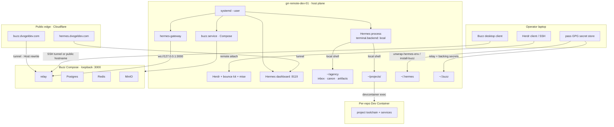

# System diagram (current)

Matches [`CONTEXT.md`](../CONTEXT.md). Host plane + agency + projects + local Hermes + Buzz. Rejected container-first topology: [`historical/system-diagram-container-first.md`](historical/system-diagram-container-first.md).

```mermaid
flowchart TB
  subgraph Laptop["Operator laptop"]
    Pass["pass GPG secret store"]
    HerdrClient["Herdr client / SSH"]
    BuzzDesktop["Buzz desktop client"]
  end

  subgraph Host["grr-remote-dev-01 · host plane"]
    direction TB
    Systemd["systemd --user"]
    Herdr["Herdr + bounce kit + mise"]
    Hermes["Hermes process<br/>terminal.backend: local"]
    Dash["Hermes dashboard :9119"]
    Gateway["hermes-gateway"]
    BuzzSvc["buzz.service · Compose"]
    Agency["~/agency<br/>inbox · canon · artifacts"]
    Projects["~/projects/<repo>"]
    HermesHome["~/.hermes"]
    BuzzHome["~/.buzz"]
  end

  subgraph BuzzStack["Buzz Compose · loopback :3000"]
    Relay["relay"]
    PG["Postgres"]
    Redis["Redis"]
    MinIO["MinIO"]
  end

  subgraph ProjectDC["Per-repo Dev Container"]
    Toolchain["project toolchain + services"]
  end

  subgraph Edge["Public edge · Cloudflare"]
    HermesCF["hermes.dvogeldev.com"]
    BuzzCF["buzz.dvogeldev.com"]
  end

  Pass -->|unwrap-hermes-env / install-buzz| HermesHome
  Pass -->|relay + backing secrets| BuzzHome
  HerdrClient -->|remote attach| Herdr
  Hermes -->|local shell| Agency
  Hermes -->|local shell| Projects
  Projects -->|devcontainer exec| ProjectDC
  Systemd --> Hermes
  Systemd --> Dash
  Systemd --> Gateway
  Systemd --> BuzzSvc
  BuzzSvc --> BuzzStack
  Gateway -->|ws://127.0.0.1:3000| Relay
  HermesCF -->|tunnel| Dash
  BuzzCF -->|tunnel · Host rewrite| Relay
  BuzzDesktop -->|SSH tunnel or public hostname| Relay
```

## Key flows

- **Operator coding:** laptop Herdr → host Herdr; toolchains via `devcontainer exec` into project containers — not a shared `dev-base` desktop.
- **Hermes shell:** `terminal.backend: local` (ADR-0004) so the agent sees `~/agency` and `~/projects`. For untrusted work, leave local shell — see [`docs/agents/untrusted-jobs.md`](../docs/agents/untrusted-jobs.md).
- **Secrets:** laptop `pass` is source of truth; VPS `~/.hermes/.env` / `~/.buzz/.env` are checkouts (ADR-0007).
- **Buzz:** host-plane Compose, loopback relay; Hermes gateway plugs in as a Bot. Dashboard is the Hermes operator UI; Buzz is the multi-actor collaboration plane.
- **Knowledge plane:** inbox → canon (git) → graph (Cognee over promoted artifacts only). MemoryProvider slot stays empty (`hermes memory off`).

## Related

- Domain language: [`CONTEXT.md`](../CONTEXT.md)
- Ops checklist: [`docs/agents/hermes-ops-checklist.md`](../docs/agents/hermes-ops-checklist.md)
- ADRs: 0001, 0003, 0004, 0007, 0008, 0011–0015
